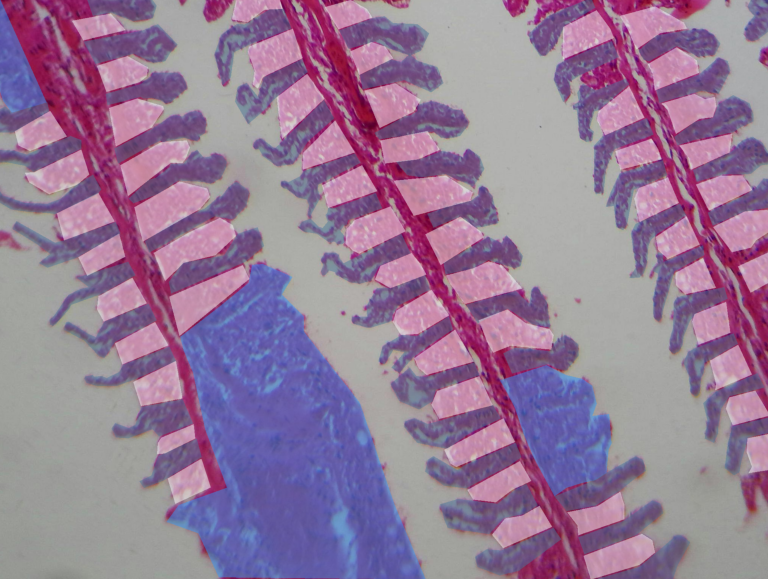
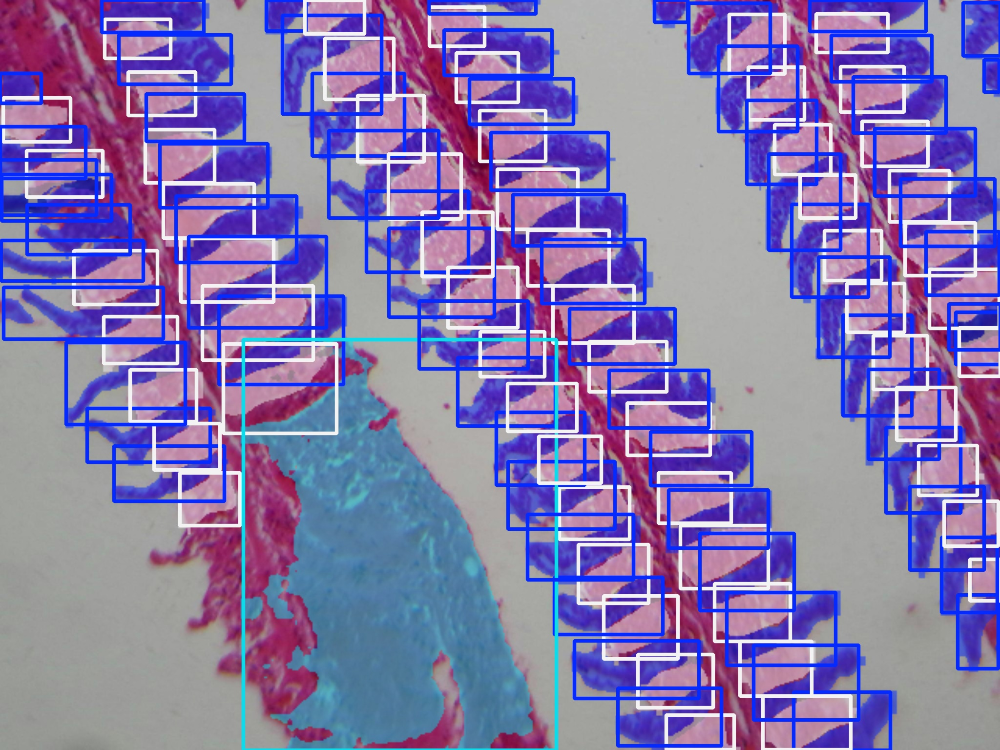
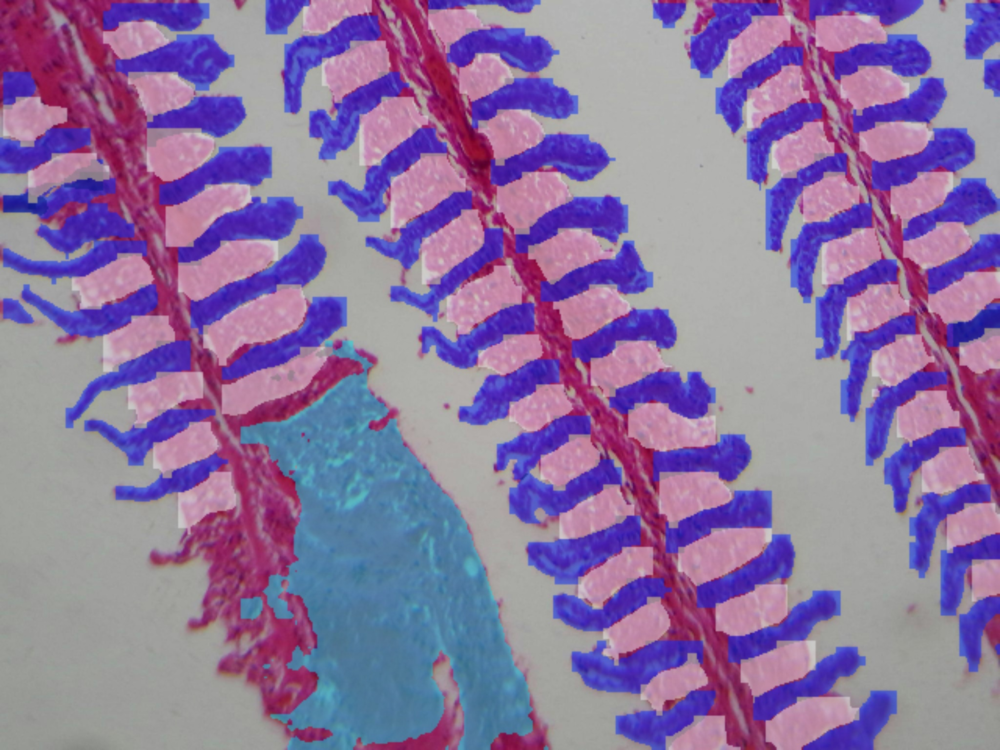

# GILLHISTDB

### About the dataset
This dataset contains 383 images with varying dimensions. The image dataset was randomly subdivided into three parts: training, validation, and testing. The training set contains 351 images (4,348 DE, 39 FU, 3,351 HI), the validation set contains 17 images (930 DE, 14 FU, 709 HI), and the testing set contains 15 images (837 DE, 11 FU, 585 HI). Thus, a total of 10,824 lesions were labeled. In total, the (DE) class has 6,156 lesions, the (FU) class has 64 lesions, and the (HI) class has 4,645 lesions. The specific details of the dataset division are presented in the following Table.

### Table: Information about the dataset used in the experiment.

| Dataset   | Número de Imagens | DE    | FU  | HI    | Total de Lesões |
|-----------|--------------------|-------|-----|--------|------------------|
| Treino    | 351                | 4348  | 39  | 3351   | 7738             |
| Validação | 17                 | 930   | 14  | 709    | 1653             |
| Teste     | 15                 | 837   | 11  | 585    | 1433             |
| **Total** | **383**            | **6156** | **64** | **4645** | **10824**         |

### Examples of Detection and Segmentation applied to the dataset, using YOLOv8n.

(a) Imagem original; (b) Máscaras de segmentação rotuladas pelo especialista; 
(c) Objetos Detectados; (d) Objetos segmentados.

<table>
  <tr>
    <td align="center">
       
      <b>(a)</b>
    </td>
    <td align="center">
       
      <b>(b)</b>
    </td>
  </tr>
  <tr>
    <td align="center">
       
      <b>(c)</b>
    </td>
    <td align="center">
       
      <b>(d)</b>
    </td>
  </tr>
</table>

<i>Fonte: O Autor.</i>

