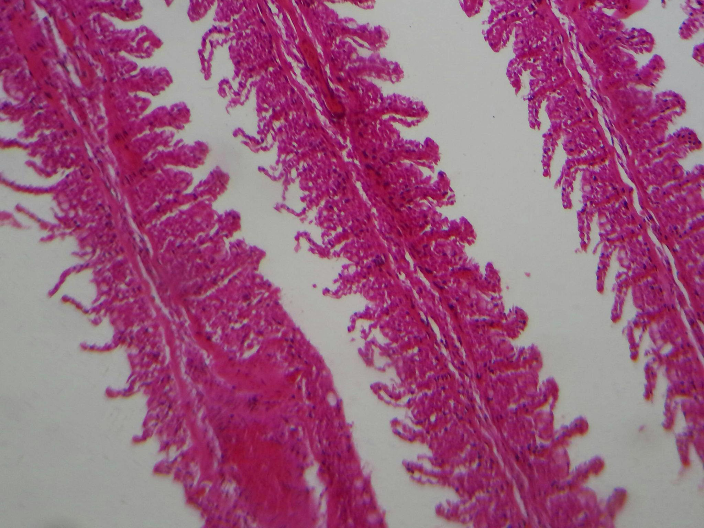

# GILLHISTDB

### Sobre o dataset
Este conjunto de dados contém 383 imagens com dimensões variadas. A base de imagens foi subdividida aleatoriamente em três partes: treino, validação e teste. O conjunto de treino contém 351 imagens (4.348 DE, 39 FU, 3.351 HI), o conjunto de validação contém 17 imagens (930 DE, 14 FU, 709 HI) e o conjunto de teste contém 15 imagens (837 DE, 11 FU, 585 HI). Dessa forma, um total de 10.824 lesões foram rotuladas. Ao todo, a classe (DE) possui 6.156 lesões, a classe (FU) possui 64 lesões e a classe (HI) possui 4.645 lesões. Os detalhes específicos da divisão do conjunto de dados estão apresentados na Tabela a seguir.

### Tabela: Divisão do conjunto de dados usado no experimento

| Dataset   | Número de Imagens | DE    | FU  | HI    | Total de Lesões |
|-----------|--------------------|-------|-----|--------|------------------|
| Treino    | 351                | 4348  | 39  | 3351   | 7738             |
| Validação | 17                 | 930   | 14  | 709    | 1653             |
| Teste     | 15                 | 837   | 11  | 585    | 1433             |
| **Total** | **383**            | **6156** | **64** | **4645** | **10824**         |

### Exemplos de Detecção e Segmentação aplicados no dataset, usando o YOLOv8n.

(a) Imagem original; (b) Máscaras de segmentação rotuladas pelo especialista; 
(c) Objetos Detectados; (d) Objetos segmentados.

<table>
  <tr>
    <td align="center">
       
      <b>(a)</b>
    </td>
    <td align="center">
       
      <b>(b)</b>
    </td>
  </tr>
  <tr>
    <td align="center">
       
      <b>(c)</b>
    </td>
    <td align="center">
       
      <b>(d)</b>
    </td>
  </tr>
</table>

<i>Fonte: O Autor.</i>

